This is a color scheme for the incredible [Pentadactyl][penta] add-on
for [Firefox][ff]. It uses the color palette [Solarized][solar],
designed by Ethan Schoonover.

This color scheme aims to be one of the most complete color schemes
available. Even the help has been styled!

This theme clears out all highlighting settings before applying its own
in order to avoid bleed over from other themes.

If you have a suggestion or find any bugs with the current
implementation, please enter an issue in the tracker:

https://github.com/claytron/pentadactyl-solarized/issues

If you appreciate the work done on this colorscheme, you could buy me a
:beer: via [Gittip](https://www.gittip.com/claytron/) :smiley:

### License

All works in this repository are licensed under a version of the
[Open Works License](owl) available for reference here:
https://github.com/claytron/pentadactyl-solarized/blob/master/LICENSE

### Install

To install this color scheme, copy it into your `~/.pentadactyl/colors`
folder, creating it if it doesn't exist:

    $ mkdir -p ~/.pentadactyl/colors
    $ cp solarized-*.penta ~/.pentadactyl/colors/.

Then change your default theme by adding the following to your
`~/.pentadactylrc`

    colorscheme solarized-light

Or if you prefer the dark version

    colorscheme solarized-dark

Then re-source your `.pentadactylrc`, or restart your browser to see the
changes go into effect.

    :source ~/.pentadactylrc

### Screenshots

#### Statusline Normal

#### Statusline Secure

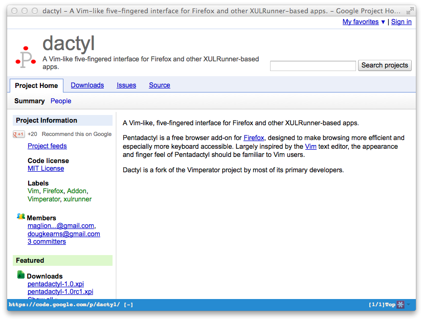

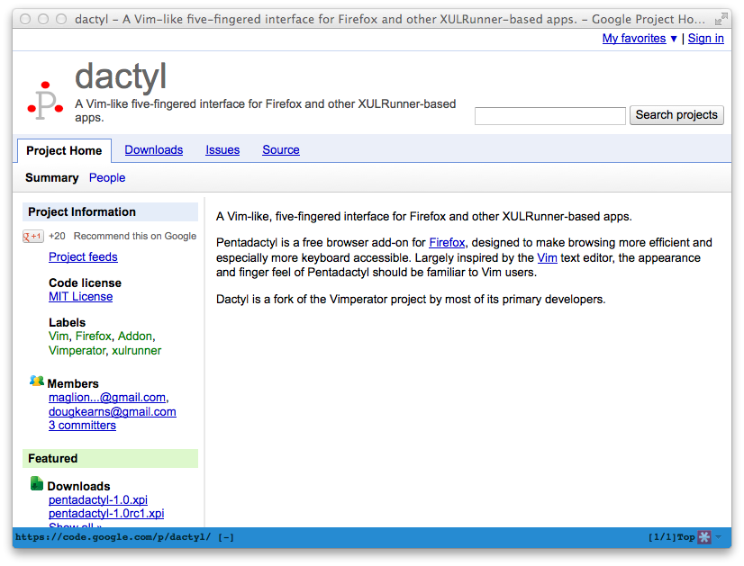

#### Statusline Extended

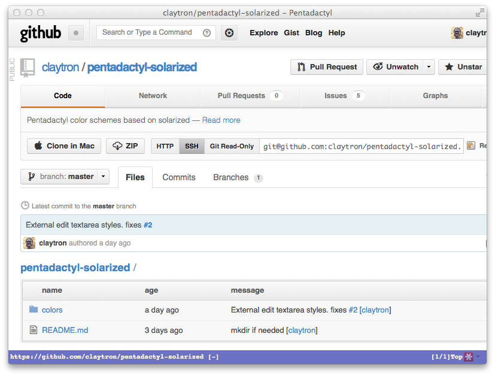

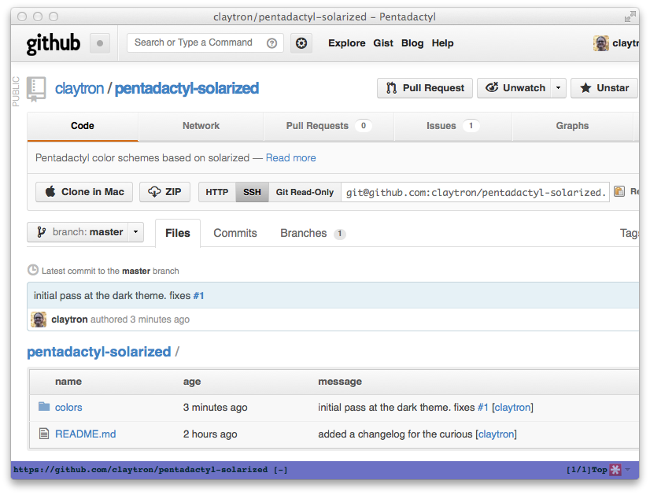

#### Statusline Broken

#### Hints

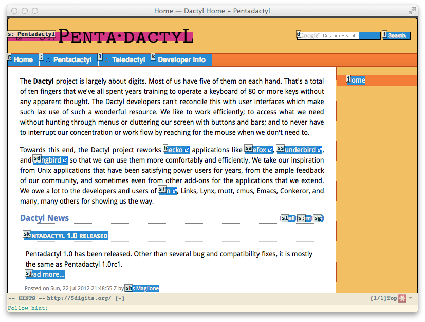

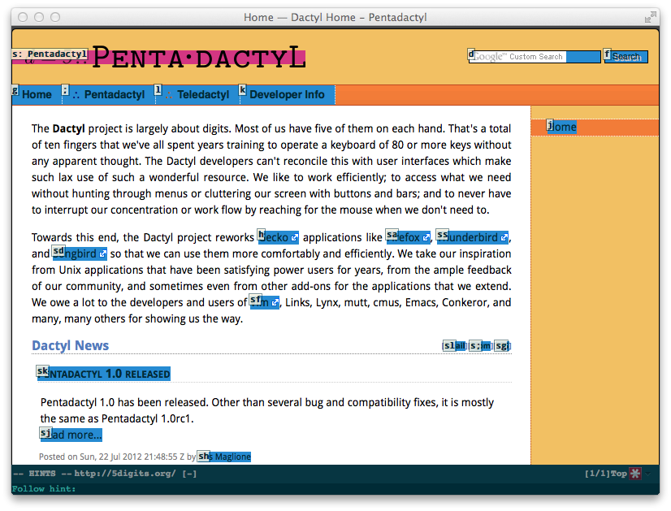

#### Completions

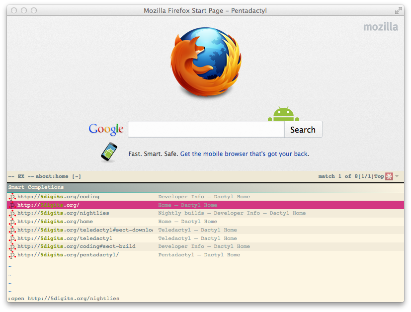

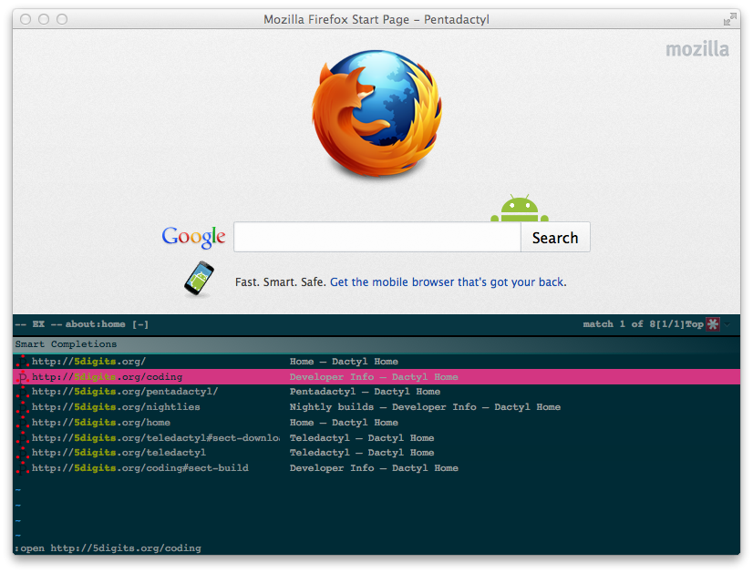

#### Buffers

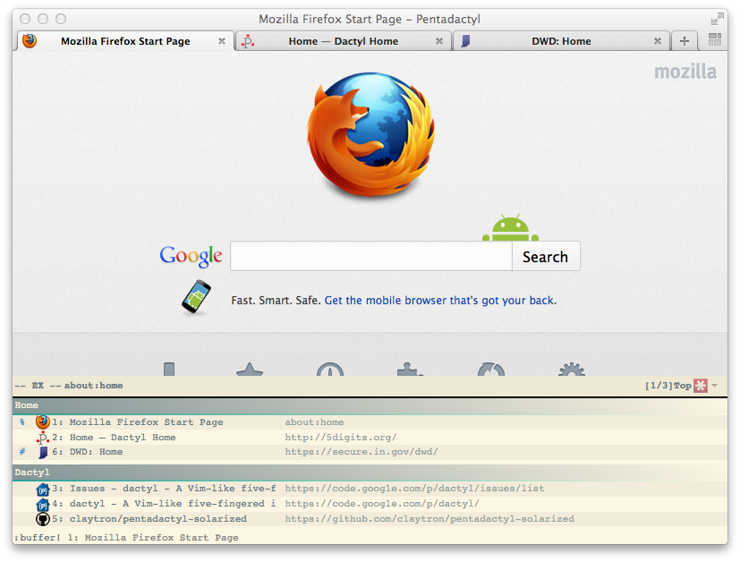

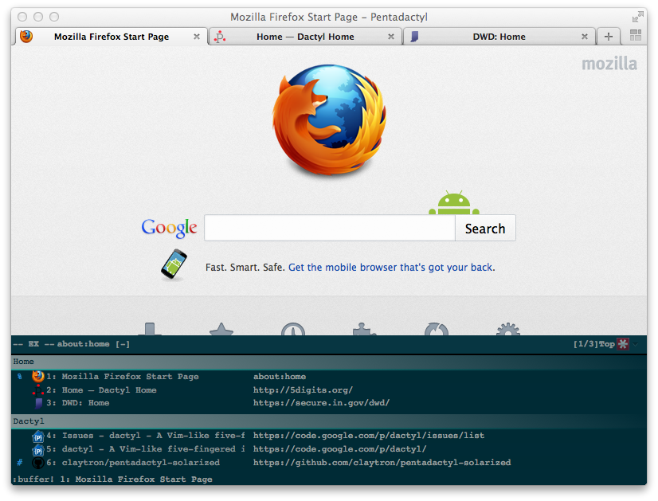

#### Help

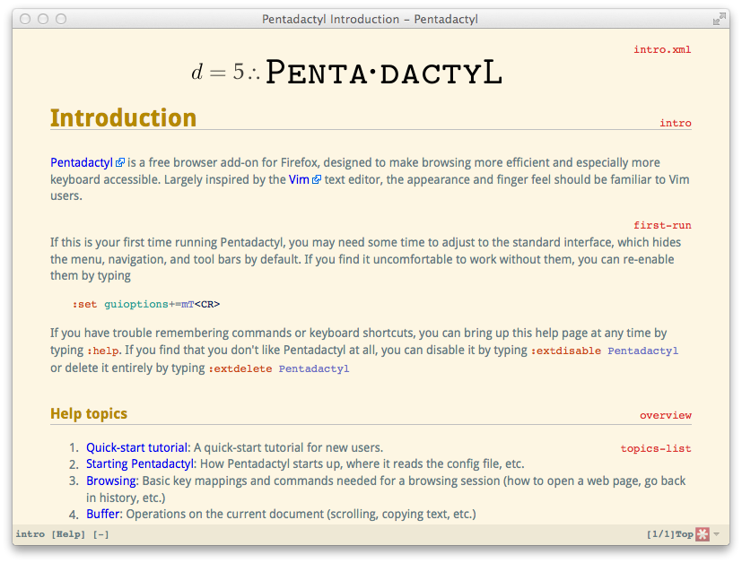

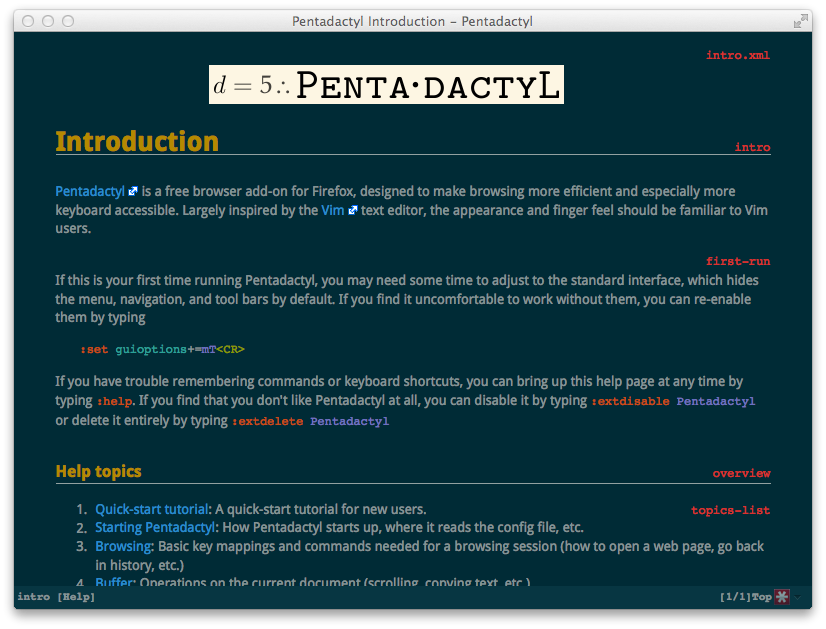

### Changelog

#### 1.0.2 (2013-05-28)

- Fix contrast in cmd line input vs suggestion

#### 1.0.1 (2012-12-20)

- Add a LICENSE
- Fix issue when `guioptions` has the `c` flag set

#### 1.0 (2012-11-09)

- Update docs
- Tag a 1.0 version as things seem stable

#### 1.0b2 (2012-10-02)

- Dark theme implemented
- Screenshots for dark theme added to README
- Fixed issue with `HelpType` not getting the color set correctly

#### 1.0b1 (2012-10-02)

- Added this changelog
- Finalized the light theme
- Made sure that every color in `:highlight` is using the Solarized
  palette
- Change buttons on the `:downloads` dialog so that they are more
  readable
- Added `HelpXML*` styles so that code blocks match Solarized in the
  help
- Links in the `:help` section are now a Solarized color, but no
  `visited` state will appear
- Finished out all the styles for the help section

#### 1.0a2 (2012-09-29)

- Fix `:downloads` screen so that `LinkInfo` is readable

#### 1.0a1 (2012-09-29)

- Initial release of the light theme
- Added README and screenshots

[ff]: https://www.mozilla.org/en-US/firefox/fx/
[penta]: http://5digits.org/pentadactyl/
[solar]: http://ethanschoonover.com/solarized
[owl]: http://copyfree.org/licenses/owl/license.txt
